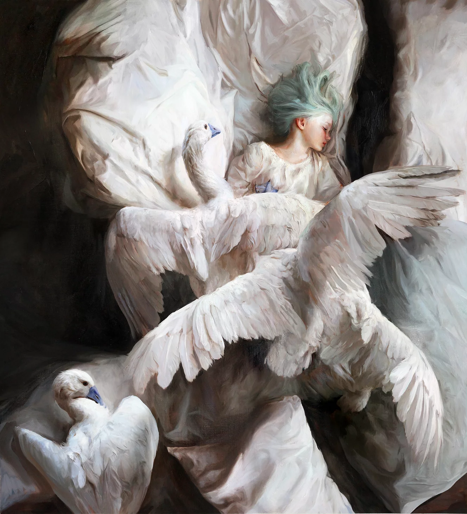

# La pintura

Una buena pintura es aquella que en primer lugar te llama la atención, luego te obliga sin que puedas controlarlo a observarla por mucho tiempo en su escencia general, luego te obliga a observar con detenimiento cada detalle y finalmente te das cuenta que no estabas observando a la obra sino que la obra te ha estado observando a vos desde el inicio y que para ese momento te ha absorbido por completo calando profundo en tu inconsciente. 

Has terminado de ver la obra y sigues caminando tranquilamente, pero ahora tenés dentro tuyo una perla pequeña colocada en un lugar muy profundo y estrátegico que se quedará contigo para siempre y que cuando tengas que tomar decisiones importantes te susurrará al oído como debes actuar. 

Analicemos con más detenimiento cada etapa. 

## Llamar la atención

Una obra que sabe llamar la atención es aquella que aún rodeada de muchas otras obras resalta sobre todas. Imaginate a vos caminando por un boulevar donde transitan cientos de personas al mismo tiempo, estás allí pensando en tus asuntos hasta que notas que alguien te guiña un ojo, o sientes una mirada ajena cubriendote, o ves venir a un hombre charlando tranquilamente con el perico que lleva en su hombro. En esos casos estás obligado a abandonar tus pensamientos y analizar a ese alguien que te rodea. 

- Se diseña primero un punto focal
- Entregas algo distinto que el observador no pueda descifrar facilmente. 
- 

# Cuál es la diferencia entre una pintura y una historia

- Entregas un punto focal
- Estableces un mundo desenfocado
- Das pistas emocionales muy bien ocultas de lo que hay en el fondo
- Expones el fondo con claridad y conectas

