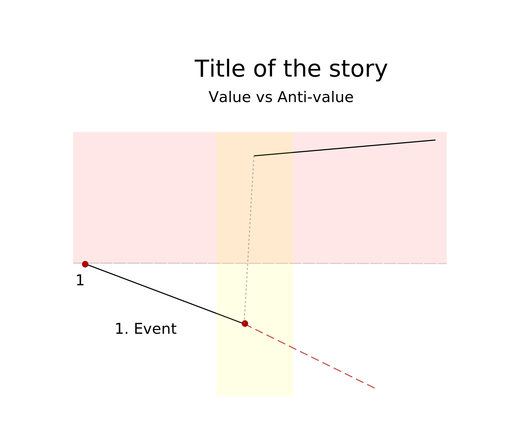
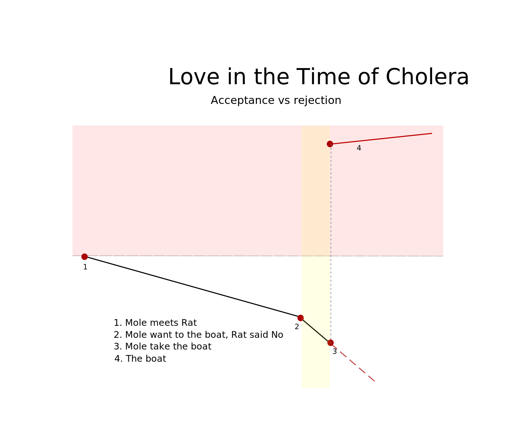
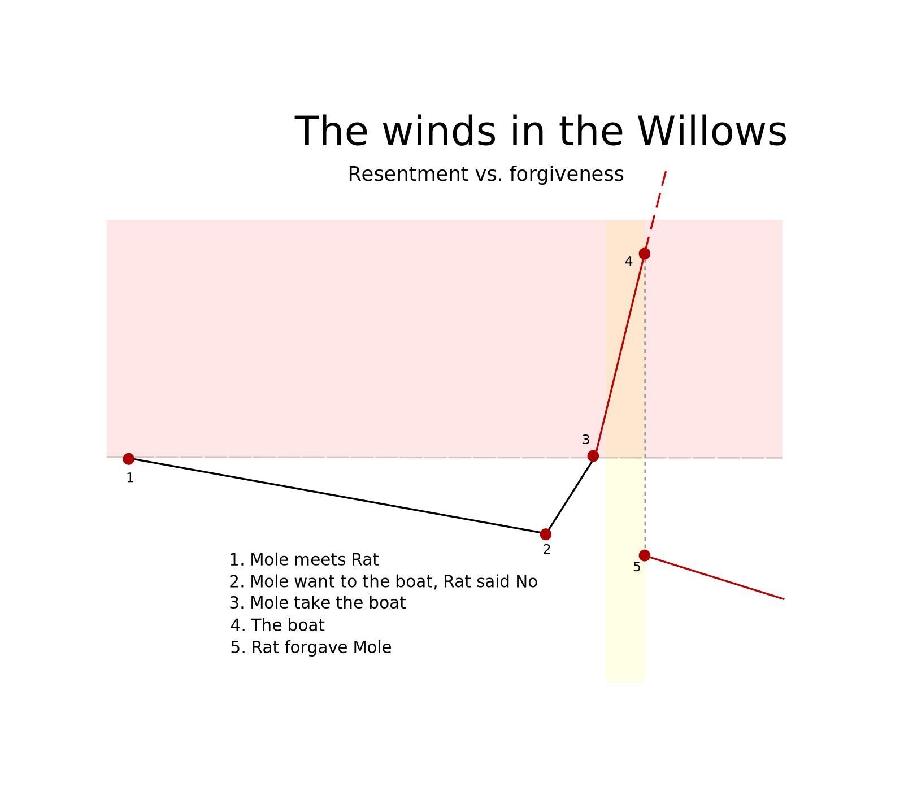
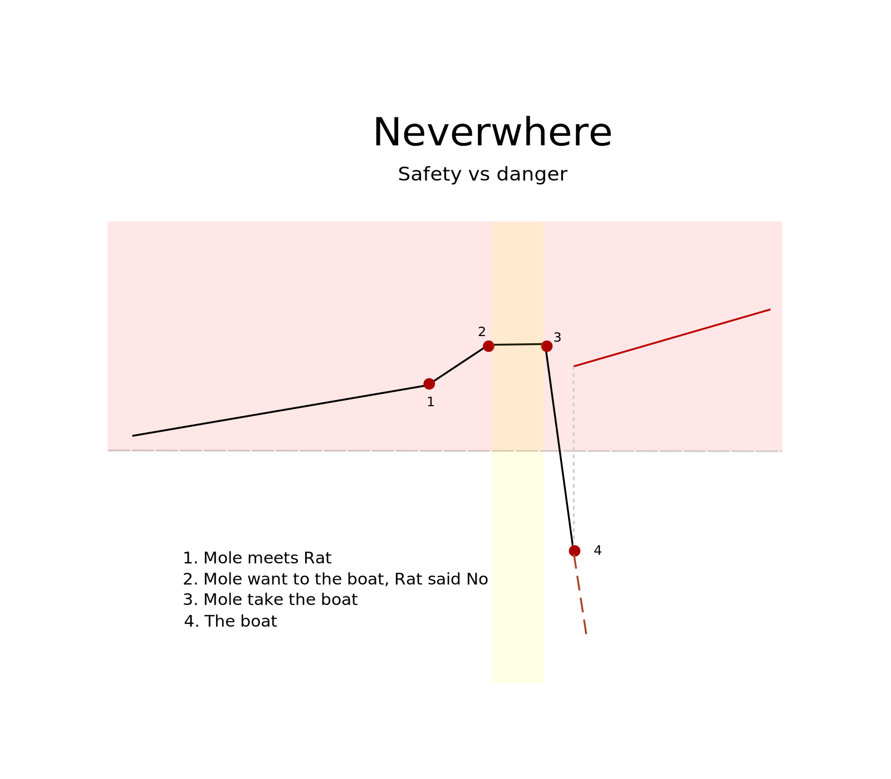
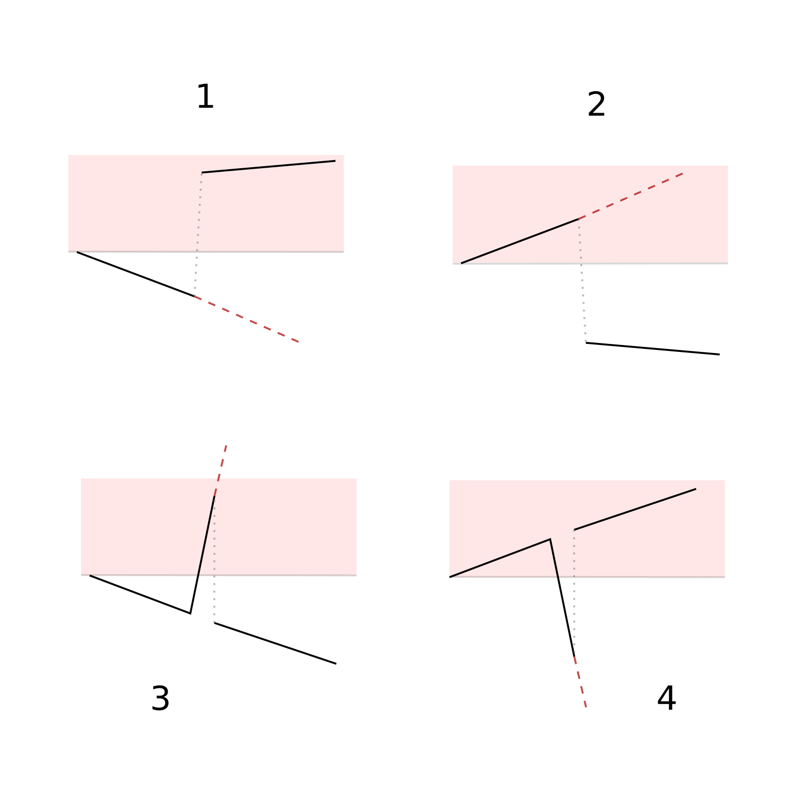
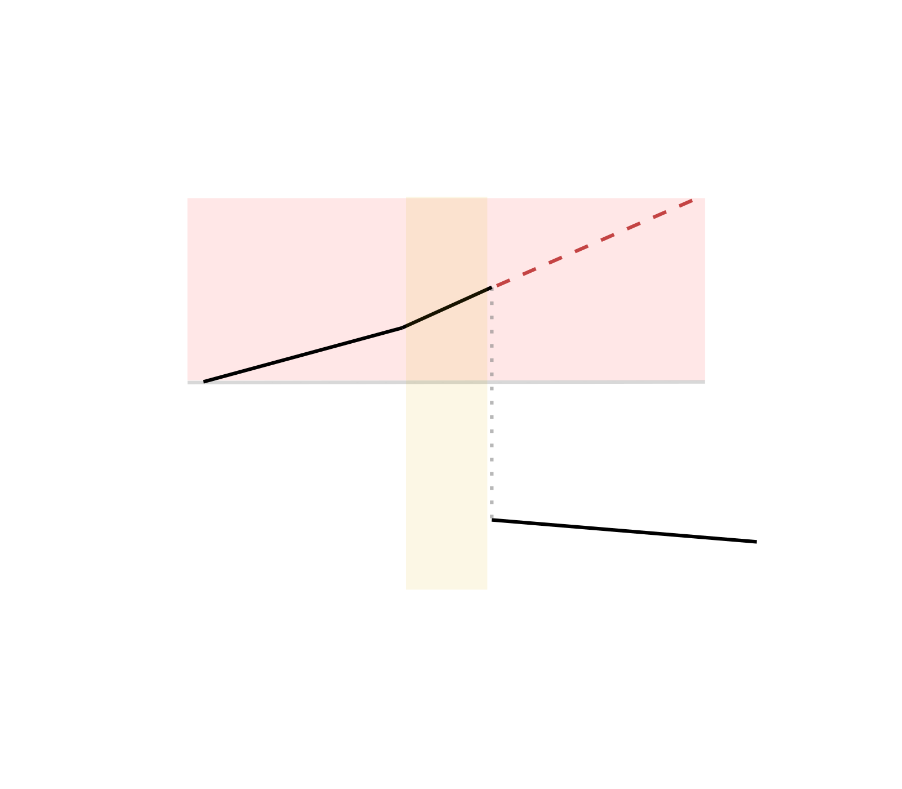

# Emotional turning point

Hi writters!

In this class we will study turning points as one **emotional** narrative tool, read some good examples, and then apply that learning in a short story. It's important to remark that we will not study **plot** in this article, this one is focused on emotions that is a completly different layer. 

Hope you learn and enjoy it as much as I do! 

## 1. Studing references

Let's star studing some shoking emocional turning points on some books. This section has the worst spoilers ever, so read carefully the title of the book before reading throughout. 

Also, I have created some graphics to help us analize the stories. The next graphic is a general model to explain how it works:

### **Love in the Time of Cholera**:

###  **The wind in the Willows**

Mi escena favorita de todas las que he visto y leído está en este libro, y es cuando rata perdona a topo después de volcar el bote. Todo nos lleva a esperar que haya un tipo de enojo y resentimiento, pero en su lugar rata reacciona con perdón. Se ve intensificado por la reacción negativa instantea que toma rata justo previo al incidente que nos hace mucho más creer en esa dirección. Y justo antes del turnin point hay una gran intensidad de acción. El turnin point nos libera información que desconociamos, aún no sabiamos cual era la personalidad de rata. 

### **Neverwhere**: 

Una de las mejores escenas que he sentido hasta en los huesos es en el puente con rataparlante. Sabemos 

### Por qué pasa el turning point emocional 

Siempre es algo que los lectores no saben. 

- Nadie sabe que iba a pasar, ni los personajes, ni el lector, ni el mundo
    - Amor en tiempos de colera.
- Nadie sabe lo que va a pasar, solo el mundo sabe la realidad. 
    - Neverwhere
    - Tea party in the woods
    - Th Descent: No salio de la cueva, era un sueño
- Se libera información solo por proceso
    - The wind in the willows
- Información que solo pocos personajes saben
    - Carta en señales que preceden el fin del mundo
- Información que sabe un personaje
    - The night circus: Ponerse el anillo, confianza, desconfianza. 

## 2. Learning from references

1) Set an emotion and it's oppossite
2) Set the graphic model
3) Set an expectation 
4) Set a deep world before the turning point. 
5) Set the turning point.

## 3. Creating the story

So, let's start creating our story. 

Before working on the turning point, I need to take some decision that give me a starting point. He are the basic: 

- This will be a children's story with a children character. 

- I want to try a natural topic and I'm deciding between: mushrrom, birds, fish or frogs. I'm using a random picker website to choose one of them. The winner was **mushrooms**. 

- I'll go with fantastical fiction because I love magic and most childrens do too. 

All the plot and details are gonna be around the turning point as the main emocional source. Let's start working on it.

### **Step 1**: Set an emotion and it's opossite 

I want a normal children's story in witch it has a happy and beuryfull ending. For choosing that first emotion let's make a random raffle again between: Juzgar/Empatía, Decepción/disfrute, Gratitud/DArlo por sentado, Rectitud apesar de limitaciones/Ignorar el problema. El tema fue Juzgar y Empatía.  

### **Step 2**: Set the graphic model

Here are the 4 possitive options. I already know that I want a happy ending, in that case I can use model 2 or 3. I'll use model 2 for the story because is the simpler of the 2. 

### **Step 3**: Set an expectation

The expectations will be that the main character would have a faster judgement and act accord it. But instead the character will control theirself, wait, receive information and realize the real situation of a secondary character. 

### **Step 4**: Set a deep world

In this stage I need the deepness necesary for the reader to forget that the end could be in another way. There are 2 options, I can reforce the original direction, I can distract the reader, or a mersh of both. I can make a fast move or a slow one. In this case I want to approach a slow one, with some details of distraction and incresment. 

### Lo que sea que sigue

La historia empieza en cero pero luego va apareciendo una tensión incremental, hasta que un evento rompe el ciclo incremental que promete empeorar las cosas significativamente. 

Palabras que van con hongos:

- Esporas
- Huesos muerte
- Hongos de multiples formas, colores, tamaños. 
- Respiramos 10 esporas por cada respiro. 
- Los hongos se alimentan por absorción
- Crecen en humedad y poca luz
- Crecen dentro de la muerte
- Algunos tienen vestido, otros tienen luz.
- Carrito que contiene todos los hongos o casita. 

Ideas de la trama básica

- Es una niña de la que desconocemos sus emociones, su pasado, su forma de reaccionar, pero entendemos como invierte su tiempo, como presta atención, y sabemos de algo que le apasiona: hongos. 

- Todo lo hace en una dirección, comprende lo que está pasando, todo lo sigue haciendo en otra dirección. Como por el bien de alguien puede cambiar por completo y seguir tan constante como siempre. Colecciona solo hongos rojos, continua con solo amarillos. 

- Talvez todo lo que pasa en el espacio de arte es significativamente para nosotros tener un criterio. 

- Se tiene que sentir posiblemente ofendido. Está abarcando cada vez más su hogar y cada vez más estropeando su trabajo. Tiene que irse aumentando la tensión sin explosivo. Si el otro es un animal el niño tendrá una reacción positiva, queremos negativa. Tiene que ser otro niño. 

- El personaje principal tiene que estar aumentado su seguridad. El otro aumentando su descaro. 

- El personaje principal no solo le da todos sus hongos, sino que ya no desea coleccionar rojo, ahora está inspirado en en otra arte aun más bella y mejor gracias al ladrón. 

- Puede no ser un niño y solo un ser natural/ficción. 

- Empatía es sentir el dolor de alguien, no debe de ser un dolor muy grave no puede ser la perdida de un ser, no puede ser hambre, ni pobreza, ni ningún tema tan delicado. 

- Cada vez el ladron dja pistas, que se pueden intepretar de dos formas. 

## Empatia

Empatía trata sobre el dolor, algunas de las razones de dolor están acá:

- Recibir odio y violencia

- Cero oportunidades

- Culpa

- Cariño no bien correspondido

- Soledad

- Trabajos no satosfactorios

- Apegos y perdidas

- Controlar algo que no se puede controlar

- Poco amor propio

- Estrés

# El tema es sobre recibir odio y violencia

- Racismo
- Xenofobia
- Genero
- Aporofobia

Salió xenofobia
Inmigrante

# Refugiados inmigrantes

Leer historias infantiles

- Vienen en botes
- Maletas
- No habla el idioma
- Como hacer un único primer amigo
- Algo qu logran los inmigrantes llevar de un lado al otro. 
- Una expresión en arte del inmigrar
- Su guitarra, su musica
- Identidad
- Culturas, religiones
- Bebes en manos, niños. 
- Dejar mascotas y amigos

# Fishes 

Cuál es el dolor más grande del ser inmigrante. El antes, el proceso o el después. TODOS!!!

Antes: Bombas, guerra, hambre, pobreza, violencia. 

Proceso: Riesgo, muerte, dolor por dejar amigos. 

Después: Rechazo, duelo, dificultades. 

--- 

No se tiene que ver la muerte en el camino, no se tiene que ver el odio directo a la cara, no se tiene que ver la lagrima de separación, no se tiene que ver la patada en la cara por odio. Pero tiene que estar ahí. 

Algo tiene que estar oculto, para dar la sorpresa. Eso oculto es el dolor. 
Se oculta quien sufre y su dolor. 
No se oculta persona, se oculta dolor. 

--

Empatía es sufrir con los demás. 

Para poner a alguien a la defensiva de lo mío. Primero tengo que afianzar su pertenencia y aprecio por lo suyo. Temor por perder lo mío. 

Necesito que el lector sienta que lo obvio es ir por el lado del rechazo. Poner al lector a la defensiva. Los otros. 

Pero a cambio el personaje es lo opuesto. Siempre estuvo pensando en ayudar a ese que venía.  

--

_____ lived in the country of _____
Most of the people lived in the valley bettween some mointans. But not ___. ___ prefere to live in the coast where the water comes with stories from other lands and other worlds. Teh love of its coast, the love of his. 

First came the dark.

4-5 boats where coming, 

Tengo que mostrar lo horrible que viene. 
Pero en verdad es lo horrible que está pasando. 

--
Tengo la historia. 
--

- Mir gustaba de la costa donde el aire fresco y los peces le contaban historias. Historias de mucho tiempo atrás y de hace poco. 

- Y con aquellas historias reía, lloraba y crecía. 

- 

- Personaje observabó con atención (noche o día)

- Un bote salió entre la neblina.

- Mir tenía todo preparado. Un relincho y unos pasos de caballo se escuchaba en la oscuridad.

- En la costa un bote y pasos recientes en la arena. 

- Los pasos de una familia.  

- Los pasos de caballos acercandose. Mir estaba allí. Vió a la familia, vió el bote vació, buscó a su alrededor no había nadie más. Una familia, solo una familia. 

- Se acercó a ellos y vió en sus ojos lo que pasó. Una brisa helada llegó del mal, que congeló a Mir y al tiempo por un momento. 

- La familia tomó del cálido ____ mientrás escucharon uncas calida voz alabras calentar que decían: Bienvenidos, los estaba esperando. 

- (Se ve como van en otro camióncito vacío con swetters)

-------

Poetico

- Las olas y su sonido. 
- La marea

--- 
Personaje 

- Venado
- Pájaro
- Cerdo
- Conejo

--- 

